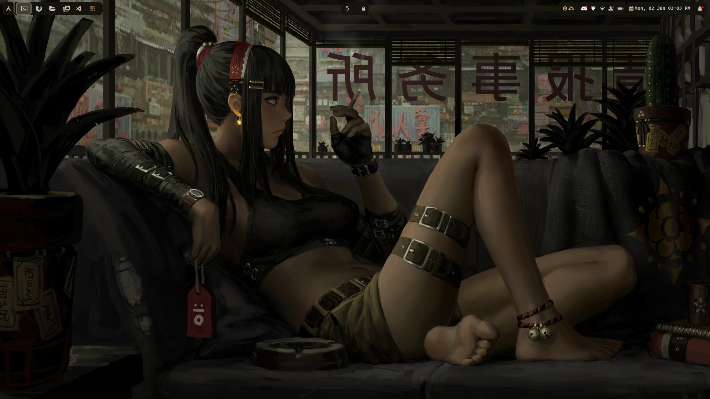
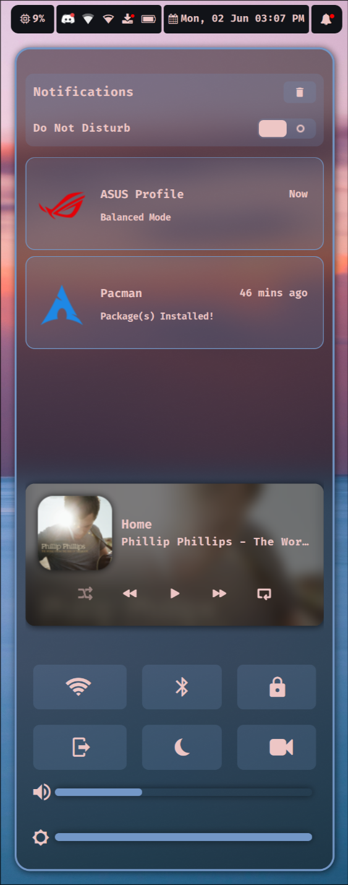

# My Linux Dotfiles (Hyprland)

Welcome to my personal dotfiles for a Wayland setup powered by **Hyprland** and a beautiful, cohesive UI/UX. This setup is customized to suit *my* workflow and preferences — feel free to take inspiration, but expect to tinker if you plan to use it directly.

> ⚠️ **Note:** These dotfiles are tailored specifically for my system. They may not work out-of-the-box for others.

---

## 📸 Showcase

---

## 🔧 Components

Colors and Theming done using `Pywal` and `Matugen`.

<strong>Hyprland</strong>
 

<table>
 <tr>
    <td></td>
    <td></td>
    <td></td>
    <td></td>
  </tr>
</table>
 

- Dynamic tiling Wayland window manager
- Configured for gaps, rounded corners, blur, and animations
- Custom keybindings, window rules, and per-monitor settings
- [Config](.config/hypr)
- [Hyprland](https://hyprland.org/)

<strong>Waybar</strong>
 
 

 

- Clean and modular status bar
- Modules: Workspaces, CPU, RAM, network, battery, clock, tray
- Styled using a custom CSS theme
- [Config](.config/waybar)
- [Waybar Github](https://github.com/Alexays/Waybar)

<strong>swaync</strong>
 

 
  
- Lightweight Wayland-native notification daemon
- Styled with matching theme to Waybar
- Auto-dismiss and grouping enabled
- [Config](.config/swaync)
- [Swaync Github](https://github.com/ErikReider/SwayNotificationCenter)

<strong>Wofi</strong>
 
 

 

- Minimal GTK-based app launcher (dmenu alternative)
- Fuzzy matching enabled
- Matches global theme
- [Config](.config/wofi)
- [Wofi Github](https://github.com/SimplyCEO/wofi)

<strong>wlogout</strong>
 
 

 

- Custom power menu with styled icons
- Logout, shutdown, reboot, etc.
- Positioned centrally with blur background
- [Config](.config/wlogout)
- [Wlogout Github](https://github.com/ArtsyMacaw/wlogout)

<strong>Fastfetch</strong>

- Fast terminal system fetch tool
- Themed output to match the rest of the system
- [Config](.config/fastfetch)
- [Fastfetch Github](https://github.com/fastfetch-cli/fastfetch)

<strong>Wallpaper</strong>

  
- A collection of hand-picked wallpapers
- Set using `waypaper` with `swww` backend.
  
 
  
<table>
 <tr>
    <td></td>
    <td></td>
    <td></td>
  </tr>
</table>

- [Waypaper Github](https://github.com/anufrievroman/waypaper)

 
---
